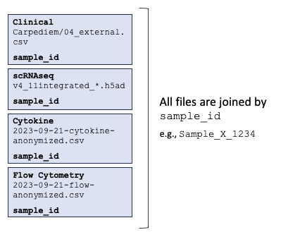

# Clinical and Single-Cell Transcriptomics for Pneumonia Codeathon


## Data Overview

[SCRIPT study](https://script.northwestern.edu/) is a prospective single-center observational study of patients who were hospitalized in a medical ICU, required mechanical ventilation, and received a bronchoalveolar lavage (BAL) for suspected pneumonia at Northwestern Memorial Hospital since 2018.

SCRIPT data consists of electronic health record (EHR) data from the ICU, and corresponding multiomic data about patients' BAL samples obtained throughout their ICU stays. Additionally, the dataset contains a small number of bronchial brushing and postmortem lung biopsy transcriptomic samples.

Each patient identifier corresponds to one patient hospitalization. During this hospitalization, patient can have 1 or more ICU stays. Each ICU stay has 1 or more ICU days. EHR data is summarized for each patient for each ICU day, and one row of EHR dataset corresponds to one patient ICU day. See detailed description on separate page linked [below](#Datasets).

EHR data has the following parts:
* patient demographic and admission data (same for all rows for the same patient)
* ICU stay number (same for all rows for the same patient and ICU stay)
* ICU day number
* clinical parameters summarized for the ICU day
* information about BAL sample if it was performed on that day
* clinical adjudication for pneumonia episodes if that day was part of the pneumonia episode

BAL sample, once obtained, usually goes through this sequence:
* Clinical analysis (for most BAL samples):
  * Cell count differential
  * PCR pathogen panel test [Biofire](https://www.biofiredx.com/products/the-filmarray-panels/filmarray-pneumonia/)
  * Culture pathogen analysis
  * Fungal smear pathogen analysis
  * Amylase quantification
* Research analysis:
  * Flow-cytometry cell type quantification
  * 10x scRNAseq transcriptomic on flow-sorted sample (depleted Neutrophils), generating 1 or 2 libraries
  * BAL fluid cytokine measurements
 
Data from the clinical analysis of BAL samples (see above) is recorded in the EHR data corresponding to the ICU patient-day when BAL sample was performed. Single-cell RNA-sequencing data is stored separately in `h5ad` files, with the BAL sample identifier available in the metadata for linking to the EHR data.

### Dataset Documentation

1. [Clinical (CarpeDiem)](docs/Clinical-Metadata.md)
2. [Single-cell RNA](docs/scRNA-Metadata.md)
3. [Cytokines](docs/Cytokines.md)
4. [Flow Cytometry](docs/flow_cytometry.md)




## Quest Compute Resources

Quest is Northwestern University's [Quest High-Performance Computing Cluster](https://www.it.northwestern.edu/departments/it-services-support/research/computing/quest/).  A specific allocation in Quest has been created that will be available to participants, with dedicated nodes for each project.

### Processors and Storage

For the codeathon, we will be using allocation REDACTED which has the following resources dedicated:

* 2 x GPU Nodes, each with:
  * 2x 40GB A100 GPU
  * 52 CPU cores
  * 180 GB CPU RAM
* 3 x Quest 11 CPU Nodes, each with:
   * 64 CPU cores
   * 240 GB CPU RAM

Additional [specifications on the Quest architecture is available](https://www.it.northwestern.edu/departments/it-services-support/research/computing/quest/specs.html).

Each user has [80GB available in their home directory](https://services.northwestern.edu/TDClient/30/Portal/KB/ArticleDet?ID=1546).  The codeathon allocation in REDACTED has been allocated 10TB of storage.  Some of this has been filled with the codeathon datasets, and teams may make use of the remaining space.  We will be monitoring space during the codeathon, and in the event that our allocation is filled, we may need to ask teams to remove unused files to free up space.

**Submit to node of your group**

Example to launch a script called launch_jupyter.sh

```
sbatch -w REDACTED launch_jupyter.sh  # group1

```
### Accessing Quest

Instructions for logging on to Quest using `ssh` or `FastX` are available on the ['Logging in to Quest' KB page](https://services.northwestern.edu/TDClient/30/Portal/KB/ArticleDet?ID=1541)

Assuming you are using ssh, you can enter the following at the command line:

```
ssh -X <netid>@quest.northwestern.edu
```

Quest is only available from the Northwestern network.  If you are not physically connected to the netowkr, you will need to be connected to the [GlobalProtect VPN](https://services.northwestern.edu/TDClient/30/Portal/KB/ArticleDet?ID=1818).  Please ensure you are connected to the network appropriately before attempting to access Quest.

### Codeathon Environment

The codeathon has been provisioned the REDACTED allocation.  This provides both storage and compute resources for codeathon participants on Quest.  When accessing Quest, you can `cd REDACTED` to access the data and see a collection of example programs (`examples/REDACTED_submit_examples`).

The data for the codeathon is available on Quest at REDACTED:

* [CarpeDiem](docs/Clinical-Metadata.md) - clinical data summary for hospitalizations
* [v4\_11integrated\_cleaned.h5ad](docs/scRNA-Metadata.md) - single-cell RNA sequence data in an HDF5-based format.  The `scanpy` package (see [Additional Resources](#additional-resources))

#### `conda` environments

Two `conda` environments have been created for the codeathon, one for R and one for Python:

> **First time setup** - the first time you log into Quest, you will need to [initialize conda](https://services.northwestern.edu/TDClient/30/Portal/KB/ArticleDet?ID=1672).
> 
> Run:
> 
> ```
> module load python-miniconda3
> conda init bash
> ```
> 
> Log out and log back in to Quest, and conda will be available

* Python 3.10.12 - `conda activate /projects/REDACTED/envs/hackathon`
* R 4.3.1 - `conda activate /projects/REDACTED/envs/r-hackathon`

### Jupyter Notebooks

For more information about Jupyter Notebooks and running them on Quest for the codeathon, including step-by-step instructions, please see [docs/JupyterNotebooks.md](docs/JupyterNotebooks.md).

### RStudio

For more information about RStudio and running it on Quest for the codeathon, including step-by-step instructions, please see [docs/RStudio.md](docs/RStudio.md).

### Quest Analytic Nodes

Quest makes available [analytics nodes](https://www.it.northwestern.edu/departments/it-services-support/research/computing/quest/quest-analytics-nodes.html) running RStudio ([https://rstudio.questanalytics.northwestern.edu/](https://rstudio.questanalytics.northwestern.edu/)) and JupyterHub ([https://jupyter.questanalytics.northwestern.edu/](https://jupyter.questanalytics.northwestern.edu/)).

You have access to these, and can login using your NetID and password.

> **WARNING** These are more restricted analytic environments shared by Quest users, and are not within the allocation created specifically for the codeathon.  You are able to access them, but will not be able to directly access conda environments.

## Additional Resources
- [Scanpy](https://scanpy.readthedocs.io/en/stable/tutorials.html) - python package for loading, clustering, and visualizing scRNAseq datasets
- **Quest**
  - [Quest User Guide](https://services.northwestern.edu/TDClient/30/Portal/KB/ArticleDet?ID=505) - provides a good introduction and links to other articles on using Quest
 
## Sponsors

We are grateful to our sponsors: [Chan Zuckerberg Initiative](https://chanzuckerberg.com), [NIAID Systems Biology Centers](https://www.niaid.nih.gov/research/systems-biology-consortium), [NIAID BV-BRC](https://www.bv-brc.org), [Northwestern IT](https://www.it.northwestern.edu) and the [Simpson Querrey Lung Institute for Translational Science](https://www.feinberg.northwestern.edu/sites/sqlifts/index.html).
